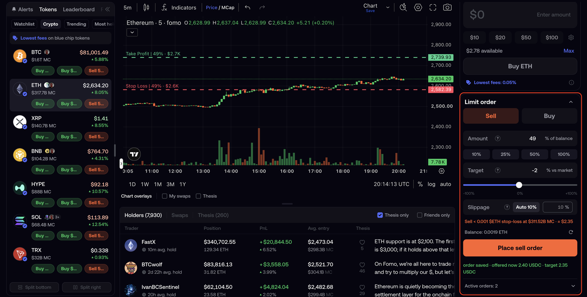
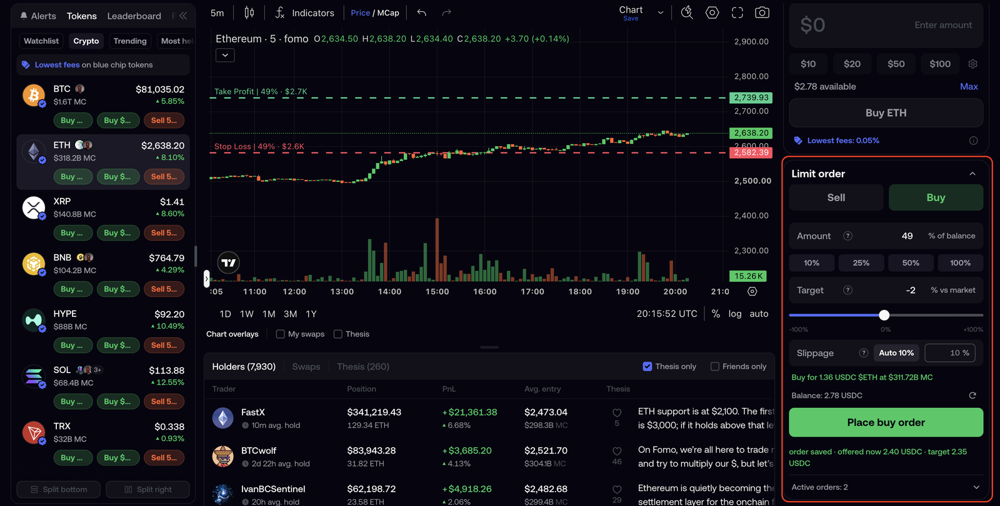
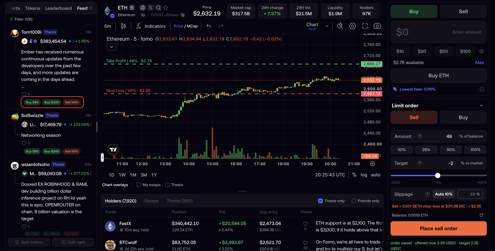
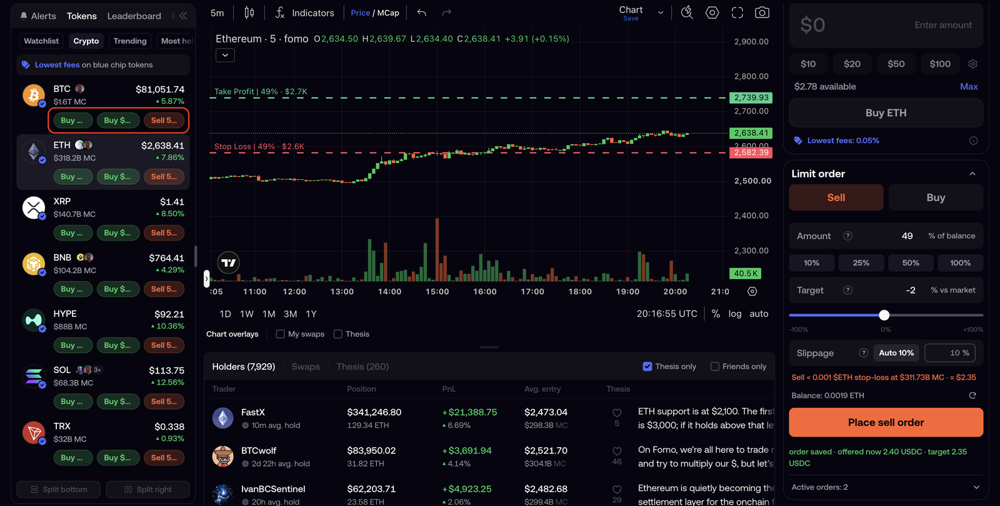
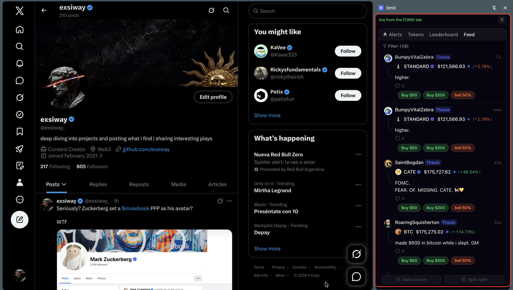
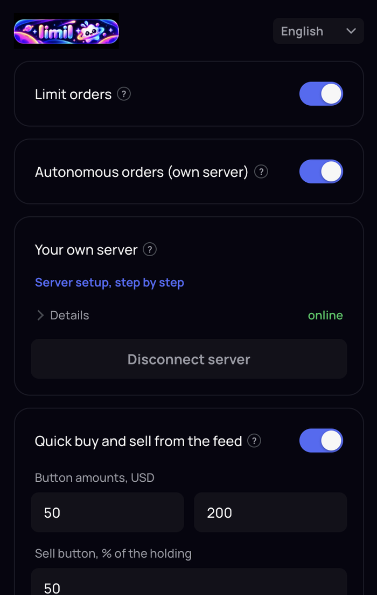
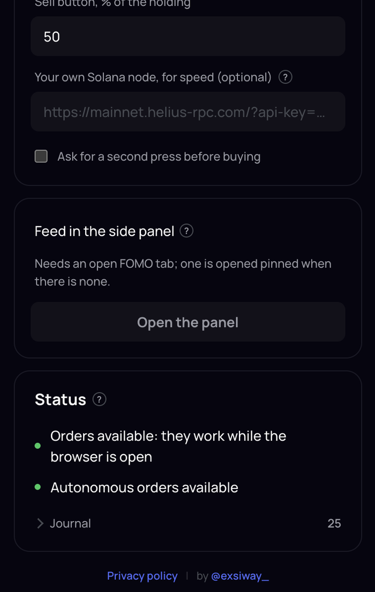

<p align="center">
  
</p>

<h1 align="center">limil</h1>

<p align="center">
  Limit orders for <a href="https://fomo.family">FOMO</a>.<br/>
  A Chrome extension that runs entirely in your browser. No account, no server of ours, no fees.
</p>

<p align="center">
  <a href="#install">Install</a> ·
  <a href="#limit-orders">Limit orders</a> ·
  <a href="docs/FEATURES.md">Every feature</a> ·
  <a href="docs/ARCHITECTURE.md">Architecture</a> ·
  <a href="docs/SECURITY.md">Security</a> ·
  <a href="docs/SELF-HOSTING.md">Self-hosting</a>
</p>

---

## What it is

FOMO is a social trading app: a feed of theses, one-tap buys and sells through
an embedded wallet, a PnL that follows every trade. One thing is missing for
anyone who trades there seriously, and this extension adds it.

It adds three things, shown below: **limit orders** that fire on their own,
**buy and sell buttons** in the feed itself, and **FOMO's feed in a side
panel** that stays with you on any site. Orders are signed by a session key
that lives in your browser and is bounded on chain in size and in price, and
every trade goes through FOMO's own pipeline, so the app records it and your
PnL stays intact.

Translation of the theses in the feed is a separate extension,
[Belingver](https://github.com/exsiway/belingver), so that each extension
does one thing. Install both if you want both.

Your keys never leave your machine. Orders stay in your browser, or go only to a server you run yourself; quotes are asked of FOMO and the public routers, exactly as FOMO's own interface asks them.
There is no account with anyone, no telemetry and no fee. The project is
unofficial and not affiliated with FOMO.

## What it looks like

### Limit orders, to sell and to buy

| Sell | Buy |
|---|---|
| [](docs/screenshots/order-panel-and-levels.png) | [](docs/screenshots/order-panel-buy.png) |

The panel appears under FOMO's own buy box on any token page. Choose **Sell**
or **Buy**, a share of the position or of your cash, and a target as a percent
away from today's price: plus for a take profit, minus for a stop loss. The
order is saved locally and drawn on the chart at once, green for a take
profit, red for a stop loss, labelled with the share it trades and the exact
level, so you see where it fires without reading a number. When the price gets
there the extension trades for you through FOMO itself, and the app records
the trade and the PnL exactly as if you had tapped it by hand.

### Buying and selling straight from the feed

| Under a card in the feed | On a row of the Tokens tab |
|---|---|
| [](docs/screenshots/quick-trade-feed-card.png) | [](docs/screenshots/quick-trade-token-row.png) |

Three buttons appear under every trade, every thesis and every token row: two
buy for a fixed amount of cash, the third sells a share of what you hold. You
set all three in the popup. Reading a thesis and buying on it is one press, in
the place where you read it, with no token page, no form and no amount to
type. By default a press arms the button and a second press within three
seconds trades, so a stray tap in a scrolling feed costs nothing.

### The feed on any site

[](docs/screenshots/side-panel-anywhere.png)

FOMO's Alerts, Tokens, Leaderboard and Feed move into Chrome's side panel and
stay there while you work in any other tab. The feed is live, not a snapshot,
and it carries the same three buttons, so a thesis you see while reading
something else can be acted on where you see it. Nothing is missed because the
FOMO tab was behind five others, and nothing has to be switched to in order to
buy.

### The extension itself

| Switches and the server | Settings and status |
|---|---|
| [](docs/screenshots/popup-switches.png) | [](docs/screenshots/popup-status.png) |

Everything is set in one window, opened from the toolbar icon.

- **Limit orders.** The master switch. On, the order panel appears on token
  pages and orders execute; the first order connects your wallet to the
  contract with one signature and no gas. Off, open orders are cancelled and
  the wallet goes back to FOMO's own contract. Turn it off before removing the
  extension.
- **Autonomous orders (own server).** Off by default, and while it is off the
  extension is entirely local: nothing is sent anywhere, no server is asked.
  On, it shows what that changes in plain words and waits for you to agree.
- **Your own server.** For orders that keep firing with the laptop closed.
  Paste the line your server prints, press Connect, and the card says
  `online`. Setting the server up is one command, see
  [docs/SETUP.md](docs/SETUP.md) part 2.
- **Quick buy and sell from the feed.** The three buttons above. Set the two
  buy amounts in dollars and the share the sell button takes, and choose
  whether a trade needs that second press.
- **Your own Solana node (optional).** It affects almost everything you do
  here, which is easy to miss. The cash in FOMO is USDC on your Solana
  address, so **every buy starts on Solana** whatever chain the token lives
  on, crossing over through relay; every sell of a Solana token is a Solana
  transaction too. Each of those is read and simulated on a Solana node before
  it is signed, so a substituted transaction cannot be signed by mistake. A
  press of the feed buttons and a limit order take the same path. The one
  trade that needs no node is a sell of an EVM token, which goes through
  FOMO's bundler on its own chain. The public nodes are slow and refuse
  bursts, which shows up as a trade taking seconds longer than it should. A
  node of your own from any provider, pasted here with its key, is asked first
  and alone, and the public ones only when it does not answer. A free tier is
  enough. The key stays in this browser and is sent nowhere else.
- **Feed in the side panel.** Opens the panel above. It needs a FOMO tab open
  somewhere; if there is none, one is opened pinned in the background.
- **Status.** Two lamps that answer one question each, by asking the chain
  rather than guessing: will an order execute from this browser, and will it
  execute while this browser is closed. When something is missing, the line
  says what. The **Journal** under them is what the extension did and why,
  newest last, with a Copy button for a bug report.

## Free, and staying that way

limil is a non-commercial project, made to improve the everyday experience of
FOMO users. It takes no fee on trades, has no paid tier and no
plans for one; the code is MIT and the whole product is what you see here.

If it is useful to you and you want to support the author:

- Trade on FOMO through the referral link
  [fomo.family/r/exsiway_](https://fomo.family/r/exsiway_): it gives you 10%
  off FOMO's trading fee. Nothing else changes.
- Send anything you like to `0x84cc30792dA7d8c6cec5fe6568f2d208ae4Bf972`
  on any EVM chain.

## Install

Chrome 114 or newer is required (the side panel API appeared in 114; the extension also uses `world: "MAIN"` content
scripts). Node 22 or newer builds it.

Download `limil-<version>.zip` from
[the latest release](https://github.com/exsiway/limil/releases/latest), unzip
it, open `chrome://extensions`, enable **Developer mode**, press **Load
unpacked** and choose the unzipped folder. Open a token page on fomo.family:
the **Limit order** panel appears under the trade card, and the toolbar icon
opens the popup with the settings.

To update, download the new zip over the same folder and press the reload
arrow on the extension card.

To build it from source instead:

```bash
git clone https://github.com/exsiway/limil && cd limil
npm install
npm run build
```

## Limit orders

Turn on **Limit orders** in the popup, then place an order from the panel on a
token page. An order is a side (sell or buy), a share of the balance, a target
as a percent against the current market, and a slippage tolerance. The panel
turns the percent into a market-cap level and draws it on the TradingView
chart, so you see exactly where it sits.

### One EVM sell of your own, once per wallet

Before any of this works, make one ordinary sell in FOMO yourself, **of a
token on Robinhood Chain, BNB Chain or Base, for $2 or more.** Not a buy and
not a Solana token: the cash you buy with is USDC on Solana, so a buy is
signed the Solana way, and so is a sell of a Solana token. Neither teaches the
extension anything it can use, because what it needs is an EVM signature.

The extension does not hold your wallet key. It signs by replaying a signing
request of FOMO's own page, and it can only capture such a request when the
page really asks for a signature, an ordinary page load does not, and placing
an order in the panel does not either. So the envelope has to come from a
trade you make yourself, once.

- **$2 or more**: FOMO refuses a trade under two dollars, so a token dust
  sell will not do.
- **One EVM sell covers every EVM chain**: Robinhood, BNB, Base. The captured
  envelope names a wallet, not a network.
- **Connect another account and you do it again.** The envelope belongs to the
  wallet it came from; on an account switch the old one is discarded at once,
  and the panel says so instead of failing quietly.

Honest caveat: that one EVM sell covers all EVM chains follows from the code,
the envelope carries no chain, and has not been exercised across two chains
on one wallet in practice. If a sell on one chain leaves another still asking,
that is a bug worth reporting.

What happens after you press **Place**:

1. **Watching.** The extension taps the chart's own price feed. A level crossing
   wakes the executor, which asks FOMO for a quote. Quotes are also taken every
   two minutes as a control, because the chart level is derived from a market
   cap that lags.
2. **Confirming.** Two paths, and they are not the same guarantee. When the
   price stream carries the level, the order is quoted at once and one quote
   at or past the target fires it, with four more every six seconds if that
   first quote falls short. On the scheduled path, with no crossing seen, the
   target has to hold across three consecutive quotes inside a four-minute
   window, with a spread that says "a move" rather than "noise", so a single
   spike fires nothing there.
3. **Checking the exit.** Before signing, the price impact of your size is
   measured against a public quote and the order waits while it exceeds your
   tolerance. Sells carry an on-chain guard that reverts the whole trade if the
   relay depository is paid less than target minus slippage, it catches a bad
   fill, not a redirected payout. Buys are checked against the same
   aggregator the solver uses, hop by hop, before a signature exists.
4. **Signing.** The operation is signed by a session key that was created in the
   service worker and never left it. The key is valid on chain only because your
   wallet granted it: the first order delegates your wallet to the
   `LimilSessionAccount` contract (EIP-7702, one sponsored operation, reversible
   from the popup) and issues a grant sized to your orders. The contract bounds
   that key in two dimensions, taken from the swap's own arguments rather than
   from an approval: how much of each token may be sold, your live orders plus
   one retry, and the minimum it must fetch, a price fixed from the order. It
   also never lets the key move native value or transfer tokens.

   Where the proceeds go depends on which machine executes, and the
   difference is deliberate. In your browser the sale settles through relay
   and the final recipient is named in an off-chain quote the chain cannot
   see, so a stolen key could sell those amounts at that price and keep the
   money, bounded by the per-token budget and nothing finer. That key sits in
   this browser next to a logged-in FOMO session that commands the whole
   wallet, so to an attacker who already owns the machine it adds little. It
   is not nothing: extension storage taken on its own still hands over a key
   that can sell within those bounds, and `EntryPoint` is public, so whoever
   holds it can pay their own gas.

   Running a server changes nothing about that: it runs a browser too, going
   through FOMO's own bundler, so the same bounds and the same limitation
   apply. Nothing on that machine holds funds, but a logged-in browser holds
   your FOMO session, which commands the whole wallet, so that machine is as
   sensitive as your laptop. [docs/SECURITY.md](docs/SECURITY.md) §6 and
   [docs/CONTRACTS.md](docs/CONTRACTS.md) spell it out.
5. **Sending.** The signed operation goes through FOMO's bundler, exactly like a
   tap in the app. The app sees the trade and writes the PnL line.

The one sell of your own from the section above is the prerequisite for all
of this; the wallet connection itself happens per chain on the first order
there, with one signature and no gas. Sells execute on Robinhood Chain, Base
and BNB Chain.

Orders execute while a browser with a live FOMO tab is open. To keep them alive
with the laptop closed, run the bundled Docker stack on a server you control: a
Chromium with the extension logged in to FOMO plus a hub that receives the
orders you place on your laptop and hands them to that browser. Everything the
laptop can do, the server browser does too, including buys and the PnL entry.
The step-by-step guide is [docs/SETUP.md](docs/SETUP.md).


## Interface

English by default, plus 中文, 한국어, Português, हिन्दी, العربية and Русский,
switchable in the popup header. The panel takes FOMO's own colour tokens and
typeface so it reads as part of the page.

## Documentation

- **[docs/SETUP.md](docs/SETUP.md), start here.** Every step in order, the
  browser first and a server only if you want one.

| Document | What it covers |
|---|---|
| [docs/FEATURES.md](docs/FEATURES.md) | Every function of the extension, screen by screen, with the rules behind each |
| [docs/ARCHITECTURE.md](docs/ARCHITECTURE.md) | The three worlds, the message bus, how a trade travels from chart tick to bundler |
| [docs/SECURITY.md](docs/SECURITY.md) | Threat model, what the session key can and cannot do, what is not protected |
| [docs/CONTRACTS.md](docs/CONTRACTS.md) | `LimilSessionAccount` and `LimilOutputGuard`: addresses, rules, how to verify |
| [docs/PRIVACY.md](docs/PRIVACY.md) | What is stored, where it goes, what is never sent |
| [docs/SERVER-SETUP.md](docs/SERVER-SETUP.md) | Step by step, for a first server: a browser on the server executes your laptop's orders 24/7 |
| [docs/SELF-HOSTING.md](docs/SELF-HOSTING.md) | Every way to keep orders alive with the laptop closed, compared |
| [CONTRIBUTING.md](CONTRIBUTING.md) | Building, testing, project conventions |

## Repository layout

```
extension/      manifest, icons, fonts, _locales; dist/ is built by npm run build
src/main/       page world: Privy bridge, FOMO API, chart lines, swap execution
src/isolated/   content script: order panel, quick buy and sell, feed mirror
src/background/ service worker: executor, route checks, server link
src/shared/     pure logic with tests: orders, UserOp, guard, trigger
src/locales/    interface dictionaries (en is the source)
src/popup/      the popup
contracts/      LimilSessionAccount and LimilOutputGuard (Solidity 0.8.28)
daemon/         the hub: keeps orders for a browser on your server to execute
deploy/         Docker stack: the hub and a headless browser that executes
scripts/        update and pairing for a server, contract build, deploy and verify
test/           node --test suite, including the contracts on an in-memory EVM
```

## Develop

```bash
npm run build:contract   # compiles the contracts into artifacts/ (the tests need the ABI)
npm test                 # node --test, the whole suite
npm run watch            # rebuild on change
```

## Status and caveats

The extension has executed live sells and buys on Robinhood Chain and Solana.
The contracts are covered by execution tests on an in-memory EVM, on the
bytecode that is live. The Docker stacks in `deploy/`
have been exercised on a single VPS, a hub with a runner browser, not on a
fleet. Read [docs/SECURITY.md](docs/SECURITY.md) before trusting the
extension with a position you would mind losing. What the extension cannot
protect is the machine it runs on: access to your laptop, or to a server you
set up, is your responsibility, not a risk this project carries for you.

A 0.1.x extension and a 0.2.x server do not pair; update both.

## License

MIT. See [LICENSE](LICENSE). The bundled fonts, Manrope and JetBrains Mono, are
under the SIL Open Font License; their texts are in `extension/licenses/`, and
[THIRD_PARTY_NOTICES.md](THIRD_PARTY_NOTICES.md) lists everything shipped.
